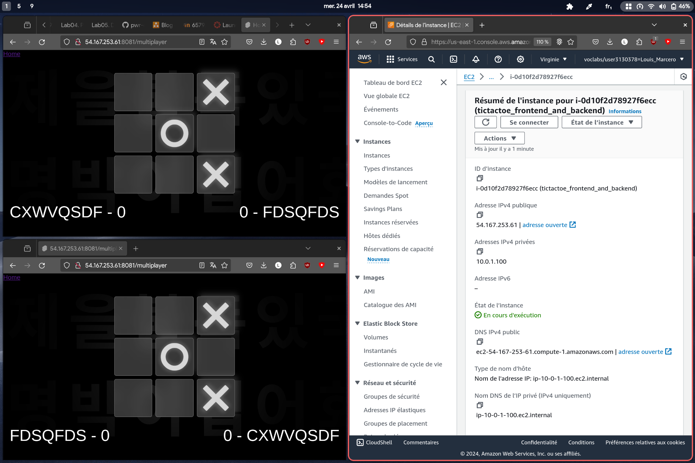

# Louis Marceron - Terraform, EC2, TicTacToe report

    Course: Cloud programming
    Group: 3
    Date: 2024-04-24

## Environement architecture:
Network
- VPC
- Subnet
- Internet Gateway
- Route Table
- Security Group

Compute
- EC2 instance with the frontend and backend applications

Software
- Frontend application running in Bun with the framework Svelete
- Backend application running in Bun
- Both applications are containerized with Docker

## Screenshots

## Reflections
What did you learn?
- Basic principles of Terraform and its application in AWS.
- Key differences in difficulty between understanding HCL and the providers.

What obstacles did you overcome?
- Initially struggled with pulling Docker images from the ECR repository due to IAM role misconfigurations.

What helped most in overcoming obstacles?
- Directly executing commands on an empty EC2 instance proved most effective, followed by scripting these commands in the EC2 userdata for automation.

Surprises?
- Found Terraform to be a less intimidating tool for configuring AWS infrastructure compared to using the AWS dashboard directly.

## TODO
- [ ] Fix my terrible frontend docker file
- [ ] Refactor user_data (it must be in a separate file + only use sudo for 
docker commands)
- [ ] Relaunch automatically the docker container when the EC2 instance is
rebooted
- [ ] Only store the build files in the docker
- [ ] Store the ws connection in a store to avoid creating a new connection 
every time the component is created
- [ ] In multiplayer mode, do the action in local and then send it to the server
for less latency
- [ ] Join a custom room by entering the room name or a link
- [ ] Join a custom room with a QR code
- [ ] Deploy the application on AWS
- [ ] Send the least amount of data from the server
- [ ] Notifications system
- [ ] Send ID of to the player to deal with the case of two players with the 
same name
- [ ] Common folder for the server and the client for TicTacToe logic and API
- [ ] Animations
